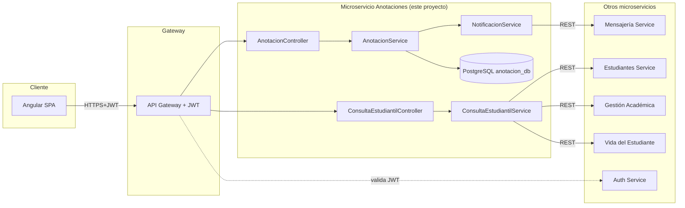
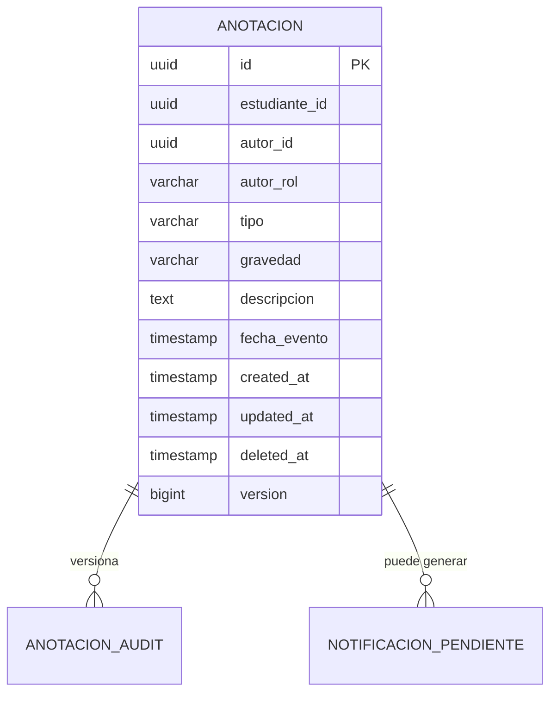
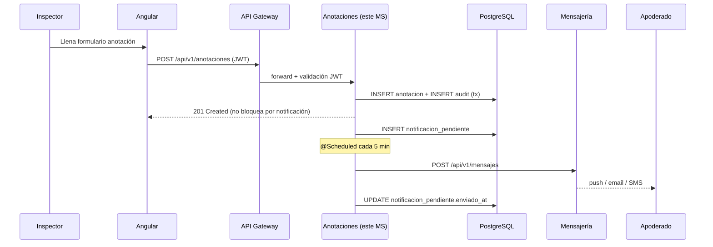

# Instructivo de Desarrollo — Microservicio de Anotaciones y Comportamiento

> SmartBook · Sistema Integral de Gestión Estudiantil · Colegio Bernardo O'Higgins
> Proyecto de título · Marzo 2026 · Duoc UC sede San Joaquín

Este documento es la **guía técnica oficial** para implementar el microservicio `anotacion`. Cualquier integrante del equipo (Deymon, Juan Carlos, Francisco, Jonathan) debe poder seguirlo de principio a fin y obtener un microservicio funcional, conectado al ecosistema SmartBook y desplegado en la VPS Nacional.

---

## 1. Resumen ejecutivo

El microservicio **Anotaciones y Comportamiento** centraliza el registro formal de observaciones conductuales (positivas y negativas) sobre los estudiantes del establecimiento, y entrega una **vista unificada de información estudiantil** consultable por apoderados, docentes, inspectores y dirección.

Forma parte de la arquitectura híbrida de SmartBook (microservicios independientes detrás de un API Gateway, con Frontend Angular y persistencia PostgreSQL dedicada).

### 1.1 Mapeo requisito → componente

| Origen en el informe | Caso / Requisito | Componente que lo implementa |
|---|---|---|
| §2.6.9 RF09 | Gestión de Anotaciones (Alta) | `AnotacionService.registrar/editar/eliminar/consultar` |
| §5.2.2.15 CU-ANO-01 | Registrar Anotación | `POST /api/v1/anotaciones` |
| §5.2.2.15 CU-ANO-02 | Editar Anotación (plazo 48 h) | `PUT /api/v1/anotaciones/{id}` |
| §5.2.2.15 CU-ANO-03 | Eliminar Anotación (soft-delete) | `DELETE /api/v1/anotaciones/{id}` |
| §5.2.2.15 CU-ANO-04 | Notificar al Apoderado | `NotificacionService` → `MensajeriaClient` |
| §5.2.2.15 CU-ANO-05 | Consultar Anotaciones | `GET /api/v1/anotaciones` |
| §5.2.2.15 CU-ANO-06 | Reporte Conductual | `GET /api/v1/anotaciones/reporte` |
| §5.2.2.6 CU-CIE-01..08 | Consulta de Información Estudiantil | `ConsultaEstudiantilController` (agregador) |
| §2.7.2 RNF02 | Seguridad y privacidad | `JwtAuthFilter`, HTTPS, `anotacion_audit` |
| §2.7.7 RNF07 | Integridad de la información | `@Valid`, CHECK constraints, `@Version` |
| §5.6 | Despliegue híbrido | Docker + VPS Nacional |

---

## 2. Arquitectura del microservicio

### 2.1 Vista lógica



### 2.2 Patrón de capas (Spring Boot)

Siguiendo la **Vista detallada — Diagrama de componentes 2** del informe (§5.5), cada módulo se descompone en:

```
Controller  →  Service  →  Repository
   ↑            ↑              ↓
  DTO       Mapper         Entidad JPA
              ↑
            Config / Security / Exception
```

### 2.3 Comunicación con otros microservicios

| Microservicio | Dirección | Protocolo | Caso de uso que lo usa |
|---|---|---|---|
| **Auth Service** | entrante (valida JWT) | RS256 (llave pública en caché) | Todo endpoint protegido |
| **Mensajería** | saliente | REST `POST /api/v1/mensajes` | CU-ANO-04 notificar apoderado |
| **Estudiantes** | saliente | REST `GET /api/v1/estudiantes/{id}` | CU-CIE-01 datos personales |
| **Gestión Académica** | saliente | REST `GET /api/v1/notas?...` | CU-CIE-02 notas |
| **Vida del Estudiante** | saliente | REST `GET /api/v1/asistencia?...` | CU-CIE-04 asistencia |

### 2.4 Política transaccional

- **Anotación + Audit**: misma transacción (`@Transactional`). Si falla el audit, se hace rollback de la anotación (RNF02 trazabilidad inalterable).
- **Notificación al apoderado**: *fuera* de la transacción. Si Mensajería no responde, se encola en `notificacion_pendiente` y un `@Scheduled` reintenta cada 5 min (consistencia eventual).

---

## 3. Stack y prerequisitos

| Componente | Versión | Verificación |
|---|---|---|
| JDK | 21 (Temurin) | `java -version` |
| Maven Wrapper | incluido | `./mvnw -v` |
| Spring Boot | 4.0.6 (parent) | ya en `pom.xml` |
| PostgreSQL | 15+ | `psql --version` |
| Docker | 24+ | `docker -v` |
| Docker Compose | v2 | `docker compose version` |
| Postman / curl | cualquiera | para probar endpoints |

Dependencias **ya declaradas** en [`pom.xml`](pom.xml) (no agregar nuevas salvo Actuator):

- `spring-boot-starter-data-jpa`
- `spring-boot-starter-validation`
- `spring-boot-starter-webmvc` (NO usar webflux para endpoints reactivos en esta etapa)
- `springdoc-openapi-starter-webmvc-ui` 3.0.2 (Swagger UI)
- `postgresql` (driver runtime)
- `lombok`

**Dependencia a agregar en `pom.xml`**:

```xml
<dependency>
    <groupId>org.springframework.boot</groupId>
    <artifactId>spring-boot-starter-actuator</artifactId>
</dependency>
```

> ⚠️ El `pom.xml` actual incluye `spring-boot-starter-webflux`. Mantenerlo solo si vas a usar `WebClient`/`RestClient` reactivo. En este instructivo usamos `RestClient` síncrono (Spring 6.1+), así que webflux puede quedar como dependencia transitoria sin impacto.

---

## 4. Estructura de paquetes

Bajo `src/main/java/cl/smartbook/anotacion/`:

```
cl.smartbook.anotacion
├── AnotacionApplication.java          (ya existe)
├── config
│   ├── SecurityConfig.java            (filtro JWT, CORS, CSRF)
│   ├── OpenApiConfig.java             (metadata Swagger)
│   ├── RestClientConfig.java          (clients hacia otros MS)
│   └── JpaAuditingConfig.java         (@EnableJpaAuditing)
├── controller
│   ├── AnotacionController.java       (CU-ANO-01..06)
│   └── ConsultaEstudiantilController.java (CU-CIE-01..08)
├── service
│   ├── AnotacionService.java          (interfaz)
│   ├── impl/
│   │   ├── AnotacionServiceImpl.java
│   │   └── ConsultaEstudiantilServiceImpl.java
│   └── NotificacionService.java
├── repository
│   ├── AnotacionRepository.java
│   ├── AnotacionAuditRepository.java
│   └── NotificacionPendienteRepository.java
├── domain
│   ├── entity
│   │   ├── Anotacion.java
│   │   ├── AnotacionAudit.java
│   │   ├── NotificacionPendiente.java
│   │   ├── TipoAnotacion.java         (enum POSITIVA, NEGATIVA)
│   │   └── Gravedad.java              (enum LEVE, MEDIA, GRAVE)
│   └── dto
│       ├── AnotacionRequest.java
│       ├── AnotacionResponse.java
│       ├── FiltroAnotacionDto.java
│       ├── EliminarAnotacionRequest.java
│       ├── ReporteConductualDto.java
│       └── InfoEstudiantilDto.java
├── mapper
│   └── AnotacionMapper.java
├── exception
│   ├── AnotacionNotFoundException.java
│   ├── EditPlazoExcedidoException.java
│   ├── AccesoDenegadoException.java
│   └── GlobalExceptionHandler.java
├── security
│   ├── JwtAuthFilter.java
│   ├── JwtTokenProvider.java
│   ├── RbacAspect.java
│   ├── annotation/RequiereRol.java
│   └── UsuarioAutenticado.java        (record con id, rol, claims)
└── client
    ├── MensajeriaClient.java
    ├── EstudiantesClient.java
    └── dto/...                        (DTOs externos)
```

---

## 5. Modelo de datos (PostgreSQL)

### 5.1 Diagrama lógico



### 5.2 DDL — `src/main/resources/db/migration/V1__init.sql`

```sql
-- Extensión para UUIDs (instalar una vez en la BD)
CREATE EXTENSION IF NOT EXISTS "pgcrypto";

CREATE TABLE anotacion (
    id              UUID            PRIMARY KEY DEFAULT gen_random_uuid(),
    estudiante_id   UUID            NOT NULL,
    autor_id        UUID            NOT NULL,
    autor_rol       VARCHAR(20)     NOT NULL,
    tipo            VARCHAR(10)     NOT NULL,
    gravedad        VARCHAR(10)     NOT NULL,
    descripcion     TEXT            NOT NULL,
    fecha_evento    TIMESTAMP       NOT NULL,
    created_at      TIMESTAMP       NOT NULL DEFAULT NOW(),
    updated_at      TIMESTAMP       NOT NULL DEFAULT NOW(),
    deleted_at      TIMESTAMP       NULL,
    version         BIGINT          NOT NULL DEFAULT 0,
    CONSTRAINT chk_anotacion_tipo
        CHECK (tipo IN ('POSITIVA', 'NEGATIVA')),
    CONSTRAINT chk_anotacion_gravedad
        CHECK (gravedad IN ('LEVE', 'MEDIA', 'GRAVE')),
    CONSTRAINT chk_anotacion_descripcion_min
        CHECK (char_length(descripcion) >= 10)
);

CREATE INDEX idx_anotacion_estudiante     ON anotacion(estudiante_id) WHERE deleted_at IS NULL;
CREATE INDEX idx_anotacion_fecha          ON anotacion(fecha_evento);
CREATE INDEX idx_anotacion_estudiante_fec ON anotacion(estudiante_id, fecha_evento DESC) WHERE deleted_at IS NULL;

-- Auditoría inalterable (RNF02 §2.7.2)
CREATE TABLE anotacion_audit (
    id              BIGSERIAL       PRIMARY KEY,
    anotacion_id    UUID            NOT NULL,
    operacion       VARCHAR(10)     NOT NULL,   -- INSERT, UPDATE, DELETE
    snapshot        JSONB           NOT NULL,   -- estado completo
    motivo          TEXT,                       -- requerido en DELETE
    autor_id        UUID            NOT NULL,
    autor_rol       VARCHAR(20)     NOT NULL,
    occurred_at     TIMESTAMP       NOT NULL DEFAULT NOW(),
    CONSTRAINT chk_audit_operacion
        CHECK (operacion IN ('INSERT', 'UPDATE', 'DELETE'))
);
CREATE INDEX idx_audit_anotacion ON anotacion_audit(anotacion_id);

-- Bloqueo de UPDATE/DELETE en la tabla de auditoría
CREATE OR REPLACE FUNCTION fn_audit_inmutable() RETURNS TRIGGER AS $$
BEGIN
    RAISE EXCEPTION 'anotacion_audit es inalterable';
END;
$$ LANGUAGE plpgsql;

CREATE TRIGGER trg_audit_no_update BEFORE UPDATE ON anotacion_audit
    FOR EACH ROW EXECUTE FUNCTION fn_audit_inmutable();
CREATE TRIGGER trg_audit_no_delete BEFORE DELETE ON anotacion_audit
    FOR EACH ROW EXECUTE FUNCTION fn_audit_inmutable();

-- Cola de notificaciones pendientes (consistencia eventual)
CREATE TABLE notificacion_pendiente (
    id              BIGSERIAL       PRIMARY KEY,
    anotacion_id    UUID            NOT NULL REFERENCES anotacion(id),
    apoderado_id    UUID            NOT NULL,
    payload         JSONB           NOT NULL,
    intentos        INT             NOT NULL DEFAULT 0,
    proximo_intento TIMESTAMP       NOT NULL DEFAULT NOW(),
    enviado_at      TIMESTAMP       NULL,
    ultimo_error    TEXT            NULL
);
CREATE INDEX idx_notif_pend_pendientes ON notificacion_pendiente(proximo_intento)
    WHERE enviado_at IS NULL;
```

> 📌 Recomendación: agregar Flyway al proyecto cuando el equipo decida formalizar las migraciones.
> ```xml
> <dependency>
>     <groupId>org.flywaydb</groupId>
>     <artifactId>flyway-core</artifactId>
> </dependency>
> ```

---

## 6. Configuración de la aplicación

### 6.1 Sustituir `application.properties` por `application.yml`

Eliminar [`src/main/resources/application.properties`](src/main/resources/application.properties) y crear:

**`src/main/resources/application.yml`**

```yaml
spring:
  application:
    name: anotacion
  profiles:
    active: ${SPRING_PROFILES_ACTIVE:dev}
  datasource:
    url: ${DB_URL:jdbc:postgresql://localhost:5432/anotacion_db}
    username: ${DB_USER:anotacion}
    password: ${DB_PASS:anotacion}
    driver-class-name: org.postgresql.Driver
  jpa:
    hibernate:
      ddl-auto: validate
    open-in-view: false
    properties:
      hibernate:
        dialect: org.hibernate.dialect.PostgreSQLDialect
        jdbc.time_zone: America/Santiago

server:
  port: ${SERVER_PORT:8081}
  forward-headers-strategy: framework
  error:
    include-message: always

management:
  endpoints:
    web:
      exposure:
        include: health,info,metrics
  endpoint:
    health:
      probes:
        enabled: true

springdoc:
  swagger-ui:
    path: /swagger-ui.html
    operationsSorter: method

smartbook:
  jwt:
    public-key-pem: ${JWT_PUBLIC_KEY_PEM:classpath:keys/auth-public.pem}
    issuer: smartbook-auth
  clients:
    mensajeria-url: ${MSG_SERVICE_URL:http://localhost:8082}
    estudiantes-url: ${EST_SERVICE_URL:http://localhost:8083}
    academica-url: ${ACA_SERVICE_URL:http://localhost:8084}
    vida-url: ${VID_SERVICE_URL:http://localhost:8085}
  reglas:
    plazo-edicion-horas: 48
    notificar-gravedad: GRAVE   # niveles que notifican automáticamente
```

### 6.2 Perfiles

**`application-dev.yml`** — para correr local:
```yaml
spring:
  jpa:
    hibernate:
      ddl-auto: update
    show-sql: true
logging:
  level:
    cl.smartbook.anotacion: DEBUG
```

**`application-prod.yml`** — para VPS:
```yaml
server:
  forward-headers-strategy: native
spring:
  jpa:
    show-sql: false
logging:
  level:
    root: INFO
```

---

## 7. Implementación capa por capa

### 7.1 Entidades JPA

**`domain/entity/TipoAnotacion.java`**
```java
package cl.smartbook.anotacion.domain.entity;

public enum TipoAnotacion { POSITIVA, NEGATIVA }
```

**`domain/entity/Gravedad.java`**
```java
package cl.smartbook.anotacion.domain.entity;

public enum Gravedad { LEVE, MEDIA, GRAVE }
```

**`domain/entity/Anotacion.java`**
```java
package cl.smartbook.anotacion.domain.entity;

import jakarta.persistence.*;
import lombok.*;
import org.springframework.data.annotation.CreatedDate;
import org.springframework.data.annotation.LastModifiedDate;
import org.springframework.data.jpa.domain.support.AuditingEntityListener;

import java.time.LocalDateTime;
import java.util.UUID;

@Entity
@Table(name = "anotacion")
@EntityListeners(AuditingEntityListener.class)
@Getter @Setter @NoArgsConstructor @AllArgsConstructor @Builder
public class Anotacion {

    @Id
    @GeneratedValue
    @Column(columnDefinition = "uuid")
    private UUID id;

    @Column(name = "estudiante_id", nullable = false)
    private UUID estudianteId;

    @Column(name = "autor_id", nullable = false)
    private UUID autorId;

    @Column(name = "autor_rol", nullable = false, length = 20)
    private String autorRol;

    @Enumerated(EnumType.STRING)
    @Column(nullable = false, length = 10)
    private TipoAnotacion tipo;

    @Enumerated(EnumType.STRING)
    @Column(nullable = false, length = 10)
    private Gravedad gravedad;

    @Column(nullable = false, columnDefinition = "TEXT")
    private String descripcion;

    @Column(name = "fecha_evento", nullable = false)
    private LocalDateTime fechaEvento;

    @CreatedDate
    @Column(name = "created_at", nullable = false, updatable = false)
    private LocalDateTime createdAt;

    @LastModifiedDate
    @Column(name = "updated_at", nullable = false)
    private LocalDateTime updatedAt;

    @Column(name = "deleted_at")
    private LocalDateTime deletedAt;

    @Version
    private Long version;

    public boolean estaEliminada() { return deletedAt != null; }
    public void marcarEliminada() { this.deletedAt = LocalDateTime.now(); }
}
```

**`domain/entity/AnotacionAudit.java`**
```java
package cl.smartbook.anotacion.domain.entity;

import jakarta.persistence.*;
import lombok.*;
import org.hibernate.annotations.JdbcTypeCode;
import org.hibernate.type.SqlTypes;

import java.time.LocalDateTime;
import java.util.UUID;

@Entity
@Table(name = "anotacion_audit")
@Getter @Setter @NoArgsConstructor @AllArgsConstructor @Builder
public class AnotacionAudit {

    @Id @GeneratedValue(strategy = GenerationType.IDENTITY)
    private Long id;

    @Column(name = "anotacion_id", nullable = false)
    private UUID anotacionId;

    @Column(nullable = false, length = 10)
    private String operacion;     // INSERT | UPDATE | DELETE

    @JdbcTypeCode(SqlTypes.JSON)
    @Column(columnDefinition = "jsonb", nullable = false)
    private String snapshot;      // JSON serializado

    @Column(columnDefinition = "TEXT")
    private String motivo;

    @Column(name = "autor_id", nullable = false)
    private UUID autorId;

    @Column(name = "autor_rol", nullable = false, length = 20)
    private String autorRol;

    @Column(name = "occurred_at", nullable = false)
    private LocalDateTime occurredAt;
}
```

**`domain/entity/NotificacionPendiente.java`**
```java
package cl.smartbook.anotacion.domain.entity;

import jakarta.persistence.*;
import lombok.*;
import org.hibernate.annotations.JdbcTypeCode;
import org.hibernate.type.SqlTypes;

import java.time.LocalDateTime;
import java.util.UUID;

@Entity
@Table(name = "notificacion_pendiente")
@Getter @Setter @NoArgsConstructor @AllArgsConstructor @Builder
public class NotificacionPendiente {

    @Id @GeneratedValue(strategy = GenerationType.IDENTITY)
    private Long id;

    @Column(name = "anotacion_id", nullable = false)
    private UUID anotacionId;

    @Column(name = "apoderado_id", nullable = false)
    private UUID apoderadoId;

    @JdbcTypeCode(SqlTypes.JSON)
    @Column(columnDefinition = "jsonb", nullable = false)
    private String payload;

    @Column(nullable = false)
    private Integer intentos;

    @Column(name = "proximo_intento", nullable = false)
    private LocalDateTime proximoIntento;

    @Column(name = "enviado_at")
    private LocalDateTime enviadoAt;

    @Column(name = "ultimo_error", columnDefinition = "TEXT")
    private String ultimoError;
}
```

### 7.2 DTOs y validaciones

**`domain/dto/AnotacionRequest.java`**
```java
package cl.smartbook.anotacion.domain.dto;

import cl.smartbook.anotacion.domain.entity.Gravedad;
import cl.smartbook.anotacion.domain.entity.TipoAnotacion;
import jakarta.validation.constraints.*;
import java.time.LocalDateTime;
import java.util.UUID;

public record AnotacionRequest(
        @NotNull UUID estudianteId,
        @NotNull TipoAnotacion tipo,
        @NotNull Gravedad gravedad,
        @NotBlank @Size(min = 10, max = 2000) String descripcion,
        @NotNull @PastOrPresent LocalDateTime fechaEvento
) {}
```

**`domain/dto/AnotacionResponse.java`**
```java
package cl.smartbook.anotacion.domain.dto;

import cl.smartbook.anotacion.domain.entity.Gravedad;
import cl.smartbook.anotacion.domain.entity.TipoAnotacion;
import java.time.LocalDateTime;
import java.util.UUID;

public record AnotacionResponse(
        UUID id,
        UUID estudianteId,
        UUID autorId,
        String autorRol,
        TipoAnotacion tipo,
        Gravedad gravedad,
        String descripcion,
        LocalDateTime fechaEvento,
        LocalDateTime createdAt,
        LocalDateTime updatedAt
) {}
```

**`domain/dto/FiltroAnotacionDto.java`**
```java
package cl.smartbook.anotacion.domain.dto;

import cl.smartbook.anotacion.domain.entity.TipoAnotacion;
import java.time.LocalDateTime;
import java.util.UUID;

public record FiltroAnotacionDto(
        UUID estudianteId,
        TipoAnotacion tipo,
        LocalDateTime desde,
        LocalDateTime hasta
) {}
```

**`domain/dto/EliminarAnotacionRequest.java`**
```java
package cl.smartbook.anotacion.domain.dto;

import jakarta.validation.constraints.NotBlank;
import jakarta.validation.constraints.Size;

public record EliminarAnotacionRequest(
        @NotBlank @Size(min = 10, max = 500) String motivo
) {}
```

### 7.3 Repositorios

**`repository/AnotacionRepository.java`**
```java
package cl.smartbook.anotacion.repository;

import cl.smartbook.anotacion.domain.entity.Anotacion;
import cl.smartbook.anotacion.domain.entity.TipoAnotacion;
import org.springframework.data.domain.Page;
import org.springframework.data.domain.Pageable;
import org.springframework.data.jpa.repository.JpaRepository;
import org.springframework.data.jpa.repository.Query;
import org.springframework.data.repository.query.Param;

import java.time.LocalDateTime;
import java.util.Optional;
import java.util.UUID;

public interface AnotacionRepository extends JpaRepository<Anotacion, UUID> {

    Optional<Anotacion> findByIdAndDeletedAtIsNull(UUID id);

    @Query("""
            SELECT a FROM Anotacion a
            WHERE a.deletedAt IS NULL
              AND (:estudianteId IS NULL OR a.estudianteId = :estudianteId)
              AND (:tipo IS NULL OR a.tipo = :tipo)
              AND (:desde IS NULL OR a.fechaEvento >= :desde)
              AND (:hasta IS NULL OR a.fechaEvento <= :hasta)
            ORDER BY a.fechaEvento DESC
           """)
    Page<Anotacion> buscar(@Param("estudianteId") UUID estudianteId,
                            @Param("tipo") TipoAnotacion tipo,
                            @Param("desde") LocalDateTime desde,
                            @Param("hasta") LocalDateTime hasta,
                            Pageable pageable);

    @Query("""
            SELECT a.tipo, a.gravedad, COUNT(a)
            FROM Anotacion a
            WHERE a.deletedAt IS NULL
              AND a.estudianteId IN :estudianteIds
              AND a.fechaEvento BETWEEN :desde AND :hasta
            GROUP BY a.tipo, a.gravedad
           """)
    java.util.List<Object[]> resumenPorEstudiantes(
            @Param("estudianteIds") java.util.List<UUID> estudianteIds,
            @Param("desde") LocalDateTime desde,
            @Param("hasta") LocalDateTime hasta);
}
```

**`repository/AnotacionAuditRepository.java`**
```java
package cl.smartbook.anotacion.repository;

import cl.smartbook.anotacion.domain.entity.AnotacionAudit;
import org.springframework.data.jpa.repository.JpaRepository;

public interface AnotacionAuditRepository extends JpaRepository<AnotacionAudit, Long> {
}
```

### 7.4 Mapper

**`mapper/AnotacionMapper.java`**
```java
package cl.smartbook.anotacion.mapper;

import cl.smartbook.anotacion.domain.dto.AnotacionRequest;
import cl.smartbook.anotacion.domain.dto.AnotacionResponse;
import cl.smartbook.anotacion.domain.entity.Anotacion;
import cl.smartbook.anotacion.security.UsuarioAutenticado;
import org.springframework.stereotype.Component;

@Component
public class AnotacionMapper {

    public Anotacion toEntity(AnotacionRequest req, UsuarioAutenticado autor) {
        return Anotacion.builder()
                .estudianteId(req.estudianteId())
                .autorId(autor.id())
                .autorRol(autor.rol())
                .tipo(req.tipo())
                .gravedad(req.gravedad())
                .descripcion(req.descripcion())
                .fechaEvento(req.fechaEvento())
                .build();
    }

    public AnotacionResponse toResponse(Anotacion a) {
        return new AnotacionResponse(
                a.getId(), a.getEstudianteId(), a.getAutorId(), a.getAutorRol(),
                a.getTipo(), a.getGravedad(), a.getDescripcion(), a.getFechaEvento(),
                a.getCreatedAt(), a.getUpdatedAt());
    }
}
```

### 7.5 Servicios

**`service/AnotacionService.java`** (interfaz)
```java
package cl.smartbook.anotacion.service;

import cl.smartbook.anotacion.domain.dto.*;
import cl.smartbook.anotacion.security.UsuarioAutenticado;
import org.springframework.data.domain.Page;
import org.springframework.data.domain.Pageable;

import java.util.UUID;

public interface AnotacionService {
    AnotacionResponse registrar(AnotacionRequest req, UsuarioAutenticado autor);
    AnotacionResponse editar(UUID id, AnotacionRequest req, UsuarioAutenticado autor);
    void eliminar(UUID id, EliminarAnotacionRequest motivo, UsuarioAutenticado autor);
    Page<AnotacionResponse> consultar(FiltroAnotacionDto filtro, Pageable pageable, UsuarioAutenticado consultor);
    ReporteConductualDto reporte(UUID cursoId, String periodo, UsuarioAutenticado consultor);
}
```

**`service/impl/AnotacionServiceImpl.java`**
```java
package cl.smartbook.anotacion.service.impl;

import cl.smartbook.anotacion.domain.dto.*;
import cl.smartbook.anotacion.domain.entity.*;
import cl.smartbook.anotacion.exception.*;
import cl.smartbook.anotacion.mapper.AnotacionMapper;
import cl.smartbook.anotacion.repository.AnotacionAuditRepository;
import cl.smartbook.anotacion.repository.AnotacionRepository;
import cl.smartbook.anotacion.security.UsuarioAutenticado;
import cl.smartbook.anotacion.service.AnotacionService;
import cl.smartbook.anotacion.service.NotificacionService;
import com.fasterxml.jackson.databind.ObjectMapper;
import lombok.RequiredArgsConstructor;
import lombok.extern.slf4j.Slf4j;
import org.springframework.beans.factory.annotation.Value;
import org.springframework.data.domain.Page;
import org.springframework.data.domain.Pageable;
import org.springframework.stereotype.Service;
import org.springframework.transaction.annotation.Transactional;

import java.time.LocalDateTime;
import java.util.List;
import java.util.UUID;

@Slf4j
@Service
@RequiredArgsConstructor
public class AnotacionServiceImpl implements AnotacionService {

    private final AnotacionRepository anotacionRepo;
    private final AnotacionAuditRepository auditRepo;
    private final AnotacionMapper mapper;
    private final NotificacionService notificacionService;
    private final ObjectMapper objectMapper;

    @Value("${smartbook.reglas.plazo-edicion-horas:48}")
    private long plazoEdicionHoras;

    @Value("${smartbook.reglas.notificar-gravedad:GRAVE}")
    private Gravedad gravedadNotificable;

    @Override
    @Transactional
    public AnotacionResponse registrar(AnotacionRequest req, UsuarioAutenticado autor) {
        if (!List.of("DOCENTE", "INSPECTOR").contains(autor.rol())) {
            throw new AccesoDenegadoException("Solo docentes o inspectores pueden registrar anotaciones");
        }
        Anotacion entidad = mapper.toEntity(req, autor);
        Anotacion guardada = anotacionRepo.save(entidad);
        registrarAuditoria(guardada, "INSERT", null, autor);

        // CU-ANO-04: notificar si la gravedad lo amerita o si es negativa
        if (debeNotificar(guardada)) {
            notificacionService.encolarNotificacionApoderado(guardada);
        }
        log.info("Anotación {} registrada para estudiante {}", guardada.getId(), guardada.getEstudianteId());
        return mapper.toResponse(guardada);
    }

    @Override
    @Transactional
    public AnotacionResponse editar(UUID id, AnotacionRequest req, UsuarioAutenticado autor) {
        Anotacion a = obtenerVigente(id);
        if (!a.getAutorId().equals(autor.id())) {
            throw new AccesoDenegadoException("Solo el autor puede editar su anotación");
        }
        if (LocalDateTime.now().isAfter(a.getCreatedAt().plusHours(plazoEdicionHoras))) {
            throw new EditPlazoExcedidoException("Plazo de edición de %d horas excedido".formatted(plazoEdicionHoras));
        }
        a.setTipo(req.tipo());
        a.setGravedad(req.gravedad());
        a.setDescripcion(req.descripcion());
        a.setFechaEvento(req.fechaEvento());
        Anotacion actualizada = anotacionRepo.save(a);
        registrarAuditoria(actualizada, "UPDATE", null, autor);
        return mapper.toResponse(actualizada);
    }

    @Override
    @Transactional
    public void eliminar(UUID id, EliminarAnotacionRequest body, UsuarioAutenticado autor) {
        if (!List.of("INSPECTOR", "DIRECTOR").contains(autor.rol())) {
            throw new AccesoDenegadoException("Solo inspector o director pueden eliminar");
        }
        Anotacion a = obtenerVigente(id);
        a.marcarEliminada();
        anotacionRepo.save(a);
        registrarAuditoria(a, "DELETE", body.motivo(), autor);
        log.warn("Anotación {} eliminada por {} ({}). Motivo: {}",
                id, autor.id(), autor.rol(), body.motivo());
    }

    @Override
    @Transactional(readOnly = true)
    public Page<AnotacionResponse> consultar(FiltroAnotacionDto f, Pageable pageable, UsuarioAutenticado consultor) {
        validarAccesoConsulta(f, consultor);
        return anotacionRepo
                .buscar(f.estudianteId(), f.tipo(), f.desde(), f.hasta(), pageable)
                .map(mapper::toResponse);
    }

    @Override
    @Transactional(readOnly = true)
    public ReporteConductualDto reporte(UUID cursoId, String periodo, UsuarioAutenticado consultor) {
        if (!List.of("INSPECTOR", "DIRECTOR", "DOCENTE").contains(consultor.rol())) {
            throw new AccesoDenegadoException("Sin permisos para generar reporte conductual");
        }
        // El curso → lista estudiantes se obtiene de Estudiantes Service (ver §9)
        // Aquí dejamos un esqueleto: se inyectaría EstudiantesClient.estudiantesPorCurso(cursoId)
        return ReporteConductualDto.placeholder(cursoId, periodo);
    }

    // ----------------- helpers -----------------

    private Anotacion obtenerVigente(UUID id) {
        return anotacionRepo.findByIdAndDeletedAtIsNull(id)
                .orElseThrow(() -> new AnotacionNotFoundException(id));
    }

    private boolean debeNotificar(Anotacion a) {
        return a.getTipo() == TipoAnotacion.NEGATIVA
                || a.getGravedad().ordinal() >= gravedadNotificable.ordinal();
    }

    private void validarAccesoConsulta(FiltroAnotacionDto f, UsuarioAutenticado consultor) {
        if ("APODERADO".equals(consultor.rol()) && f.estudianteId() == null) {
            throw new AccesoDenegadoException("Apoderado debe filtrar por estudiante propio");
        }
        // La verificación apoderado→pupilo se delega en CU-CIE-07 (§8)
    }

    private void registrarAuditoria(Anotacion a, String op, String motivo, UsuarioAutenticado autor) {
        try {
            String snapshot = objectMapper.writeValueAsString(mapper.toResponse(a));
            auditRepo.save(AnotacionAudit.builder()
                    .anotacionId(a.getId())
                    .operacion(op)
                    .snapshot(snapshot)
                    .motivo(motivo)
                    .autorId(autor.id())
                    .autorRol(autor.rol())
                    .occurredAt(LocalDateTime.now())
                    .build());
        } catch (Exception e) {
            // El RNF02 exige trazabilidad: si falla, abortamos la transacción.
            throw new IllegalStateException("Falló auditoría — abortando", e);
        }
    }
}
```

**`service/NotificacionService.java`**
```java
package cl.smartbook.anotacion.service;

import cl.smartbook.anotacion.domain.entity.Anotacion;

public interface NotificacionService {
    /** Encola la notificación al apoderado para envío asíncrono al MS Mensajería. */
    void encolarNotificacionApoderado(Anotacion anotacion);

    /** Procesa la cola; ejecutado por @Scheduled cada 5 min. */
    void procesarPendientes();
}
```

**`service/impl/NotificacionServiceImpl.java`**
```java
package cl.smartbook.anotacion.service.impl;

import cl.smartbook.anotacion.client.EstudiantesClient;
import cl.smartbook.anotacion.client.MensajeriaClient;
import cl.smartbook.anotacion.domain.entity.Anotacion;
import cl.smartbook.anotacion.domain.entity.NotificacionPendiente;
import cl.smartbook.anotacion.repository.NotificacionPendienteRepository;
import cl.smartbook.anotacion.service.NotificacionService;
import com.fasterxml.jackson.databind.ObjectMapper;
import lombok.RequiredArgsConstructor;
import lombok.extern.slf4j.Slf4j;
import org.springframework.scheduling.annotation.Scheduled;
import org.springframework.stereotype.Service;
import org.springframework.transaction.annotation.Transactional;

import java.time.LocalDateTime;
import java.util.List;
import java.util.Map;

@Slf4j
@Service
@RequiredArgsConstructor
public class NotificacionServiceImpl implements NotificacionService {

    private final NotificacionPendienteRepository pendienteRepo;
    private final EstudiantesClient estudiantesClient;
    private final MensajeriaClient mensajeriaClient;
    private final ObjectMapper objectMapper;

    @Override
    @Transactional
    public void encolarNotificacionApoderado(Anotacion a) {
        try {
            var apoderadoId = estudiantesClient.apoderadoDe(a.getEstudianteId());
            var payload = Map.of(
                    "tipo", "ANOTACION_" + a.getTipo(),
                    "anotacionId", a.getId().toString(),
                    "fechaEvento", a.getFechaEvento().toString(),
                    "descripcion", a.getDescripcion()
            );
            pendienteRepo.save(NotificacionPendiente.builder()
                    .anotacionId(a.getId())
                    .apoderadoId(apoderadoId)
                    .payload(objectMapper.writeValueAsString(payload))
                    .intentos(0)
                    .proximoIntento(LocalDateTime.now())
                    .build());
        } catch (Exception e) {
            log.error("No se pudo encolar notificación para anotación {}", a.getId(), e);
        }
    }

    @Override
    @Scheduled(fixedDelayString = "PT5M")
    @Transactional
    public void procesarPendientes() {
        List<NotificacionPendiente> lote = pendienteRepo.findTop50ByEnviadoAtIsNullAndProximoIntentoBeforeOrderByProximoIntentoAsc(LocalDateTime.now());
        for (NotificacionPendiente p : lote) {
            try {
                mensajeriaClient.enviarMensaje(p.getApoderadoId(), p.getPayload());
                p.setEnviadoAt(LocalDateTime.now());
            } catch (Exception e) {
                p.setIntentos(p.getIntentos() + 1);
                p.setUltimoError(e.getMessage());
                p.setProximoIntento(LocalDateTime.now().plusMinutes(5L * p.getIntentos()));
                log.warn("Reintento {} de notificación {}: {}", p.getIntentos(), p.getId(), e.getMessage());
            }
        }
    }
}
```

**`repository/NotificacionPendienteRepository.java`**
```java
package cl.smartbook.anotacion.repository;

import cl.smartbook.anotacion.domain.entity.NotificacionPendiente;
import org.springframework.data.jpa.repository.JpaRepository;

import java.time.LocalDateTime;
import java.util.List;

public interface NotificacionPendienteRepository extends JpaRepository<NotificacionPendiente, Long> {
    List<NotificacionPendiente> findTop50ByEnviadoAtIsNullAndProximoIntentoBeforeOrderByProximoIntentoAsc(LocalDateTime ahora);
}
```

> Recuerda habilitar scheduling en la clase principal:
> ```java
> @EnableScheduling
> @SpringBootApplication
> public class AnotacionApplication { ... }
> ```

### 7.6 Controllers REST

**`controller/AnotacionController.java`**
```java
package cl.smartbook.anotacion.controller;

import cl.smartbook.anotacion.domain.dto.*;
import cl.smartbook.anotacion.security.UsuarioAutenticado;
import cl.smartbook.anotacion.security.annotation.RequiereRol;
import cl.smartbook.anotacion.service.AnotacionService;
import io.swagger.v3.oas.annotations.Operation;
import io.swagger.v3.oas.annotations.tags.Tag;
import jakarta.validation.Valid;
import lombok.RequiredArgsConstructor;
import org.springframework.data.domain.Page;
import org.springframework.data.domain.Pageable;
import org.springframework.http.ResponseEntity;
import org.springframework.web.bind.annotation.*;

import java.net.URI;
import java.time.LocalDateTime;
import java.util.UUID;

@Tag(name = "Anotaciones", description = "Gestión de anotaciones conductuales (CU-ANO-01..06)")
@RestController
@RequestMapping("/api/v1/anotaciones")
@RequiredArgsConstructor
public class AnotacionController {

    private final AnotacionService service;

    @Operation(summary = "Registrar anotación (CU-ANO-01)")
    @RequiereRol({"DOCENTE", "INSPECTOR"})
    @PostMapping
    public ResponseEntity<AnotacionResponse> registrar(
            @Valid @RequestBody AnotacionRequest body,
            UsuarioAutenticado autor) {
        var resp = service.registrar(body, autor);
        return ResponseEntity.created(URI.create("/api/v1/anotaciones/" + resp.id())).body(resp);
    }

    @Operation(summary = "Editar anotación dentro del plazo (CU-ANO-02)")
    @RequiereRol({"DOCENTE", "INSPECTOR"})
    @PutMapping("/{id}")
    public AnotacionResponse editar(@PathVariable UUID id,
                                    @Valid @RequestBody AnotacionRequest body,
                                    UsuarioAutenticado autor) {
        return service.editar(id, body, autor);
    }

    @Operation(summary = "Eliminar (soft) una anotación (CU-ANO-03)")
    @RequiereRol({"INSPECTOR", "DIRECTOR"})
    @DeleteMapping("/{id}")
    public ResponseEntity<Void> eliminar(@PathVariable UUID id,
                                         @Valid @RequestBody EliminarAnotacionRequest body,
                                         UsuarioAutenticado autor) {
        service.eliminar(id, body, autor);
        return ResponseEntity.noContent().build();
    }

    @Operation(summary = "Consultar anotaciones con filtros (CU-ANO-05)")
    @GetMapping
    public Page<AnotacionResponse> consultar(
            @RequestParam(required = false) UUID estudianteId,
            @RequestParam(required = false) cl.smartbook.anotacion.domain.entity.TipoAnotacion tipo,
            @RequestParam(required = false) LocalDateTime desde,
            @RequestParam(required = false) LocalDateTime hasta,
            Pageable pageable,
            UsuarioAutenticado consultor) {
        return service.consultar(new FiltroAnotacionDto(estudianteId, tipo, desde, hasta), pageable, consultor);
    }

    @Operation(summary = "Reporte conductual de un curso (CU-ANO-06)")
    @RequiereRol({"INSPECTOR", "DIRECTOR", "DOCENTE"})
    @GetMapping("/reporte")
    public ReporteConductualDto reporte(@RequestParam UUID cursoId,
                                        @RequestParam String periodo,
                                        UsuarioAutenticado consultor) {
        return service.reporte(cursoId, periodo, consultor);
    }
}
```

**`controller/ConsultaEstudiantilController.java`**
```java
package cl.smartbook.anotacion.controller;

import cl.smartbook.anotacion.domain.dto.InfoEstudiantilDto;
import cl.smartbook.anotacion.security.UsuarioAutenticado;
import cl.smartbook.anotacion.service.ConsultaEstudiantilService;
import io.swagger.v3.oas.annotations.Operation;
import io.swagger.v3.oas.annotations.tags.Tag;
import lombok.RequiredArgsConstructor;
import org.springframework.web.bind.annotation.*;

import java.util.UUID;

@Tag(name = "Consulta Estudiantil", description = "Vista unificada (CU-CIE-01..08)")
@RestController
@RequestMapping("/api/v1/estudiantes/{id}")
@RequiredArgsConstructor
public class ConsultaEstudiantilController {

    private final ConsultaEstudiantilService service;

    @Operation(summary = "Datos personales (CU-CIE-01)")
    @GetMapping("/datos")
    public InfoEstudiantilDto.Datos datos(@PathVariable UUID id, UsuarioAutenticado u) {
        return service.datos(id, u);
    }

    @Operation(summary = "Notas (CU-CIE-02)")
    @GetMapping("/notas")
    public InfoEstudiantilDto.Notas notas(@PathVariable UUID id,
                                          @RequestParam(required = false) String periodo,
                                          UsuarioAutenticado u) {
        return service.notas(id, periodo, u);
    }

    @Operation(summary = "Anotaciones del estudiante (CU-CIE-03)")
    @GetMapping("/anotaciones")
    public InfoEstudiantilDto.AnotacionesResumen anotaciones(@PathVariable UUID id, UsuarioAutenticado u) {
        return service.anotaciones(id, u);
    }

    @Operation(summary = "Asistencia (CU-CIE-04)")
    @GetMapping("/asistencia")
    public InfoEstudiantilDto.Asistencia asistencia(@PathVariable UUID id, UsuarioAutenticado u) {
        return service.asistencia(id, u);
    }

    @Operation(summary = "Horario (CU-CIE-05)")
    @GetMapping("/horario")
    public InfoEstudiantilDto.Horario horario(@PathVariable UUID id, UsuarioAutenticado u) {
        return service.horario(id, u);
    }

    @Operation(summary = "Exportar info consultada en PDF (CU-CIE-08)")
    @GetMapping(value = "/exportar", produces = "application/pdf")
    public byte[] exportar(@PathVariable UUID id, UsuarioAutenticado u) {
        return service.exportarPdf(id, u);
    }
}
```

### 7.7 Manejo de excepciones

**`exception/AnotacionNotFoundException.java`**
```java
package cl.smartbook.anotacion.exception;
import java.util.UUID;
public class AnotacionNotFoundException extends RuntimeException {
    public AnotacionNotFoundException(UUID id) { super("Anotación no encontrada: " + id); }
}
```

**`exception/EditPlazoExcedidoException.java`**
```java
package cl.smartbook.anotacion.exception;
public class EditPlazoExcedidoException extends RuntimeException {
    public EditPlazoExcedidoException(String msg) { super(msg); }
}
```

**`exception/AccesoDenegadoException.java`**
```java
package cl.smartbook.anotacion.exception;
public class AccesoDenegadoException extends RuntimeException {
    public AccesoDenegadoException(String msg) { super(msg); }
}
```

**`exception/GlobalExceptionHandler.java`** — Respuestas RFC 7807 (Problem Details)
```java
package cl.smartbook.anotacion.exception;

import org.springframework.http.HttpStatus;
import org.springframework.http.ProblemDetail;
import org.springframework.web.bind.MethodArgumentNotValidException;
import org.springframework.web.bind.annotation.ExceptionHandler;
import org.springframework.web.bind.annotation.RestControllerAdvice;

import java.net.URI;
import java.util.stream.Collectors;

@RestControllerAdvice
public class GlobalExceptionHandler {

    @ExceptionHandler(AnotacionNotFoundException.class)
    public ProblemDetail noEncontrada(AnotacionNotFoundException e) {
        return problem(HttpStatus.NOT_FOUND, "anotacion-no-encontrada", e.getMessage());
    }

    @ExceptionHandler(EditPlazoExcedidoException.class)
    public ProblemDetail plazo(EditPlazoExcedidoException e) {
        return problem(HttpStatus.CONFLICT, "plazo-edicion-excedido", e.getMessage());
    }

    @ExceptionHandler(AccesoDenegadoException.class)
    public ProblemDetail acceso(AccesoDenegadoException e) {
        return problem(HttpStatus.FORBIDDEN, "acceso-denegado", e.getMessage());
    }

    @ExceptionHandler(MethodArgumentNotValidException.class)
    public ProblemDetail validacion(MethodArgumentNotValidException e) {
        String detalle = e.getBindingResult().getFieldErrors().stream()
                .map(f -> f.getField() + ": " + f.getDefaultMessage())
                .collect(Collectors.joining("; "));
        return problem(HttpStatus.BAD_REQUEST, "validacion", detalle);
    }

    private ProblemDetail problem(HttpStatus status, String type, String detail) {
        ProblemDetail pd = ProblemDetail.forStatus(status);
        pd.setType(URI.create("https://smartbook.cl/errors/" + type));
        pd.setTitle(status.getReasonPhrase());
        pd.setDetail(detail);
        return pd;
    }
}
```

### 7.8 Clientes HTTP a otros microservicios

**`config/RestClientConfig.java`**
```java
package cl.smartbook.anotacion.config;

import org.springframework.beans.factory.annotation.Value;
import org.springframework.context.annotation.Bean;
import org.springframework.context.annotation.Configuration;
import org.springframework.web.client.RestClient;

import java.time.Duration;

@Configuration
public class RestClientConfig {

    @Bean("mensajeriaRestClient")
    public RestClient mensajeriaRestClient(@Value("${smartbook.clients.mensajeria-url}") String base) {
        return RestClient.builder().baseUrl(base).build();
    }

    @Bean("estudiantesRestClient")
    public RestClient estudiantesRestClient(@Value("${smartbook.clients.estudiantes-url}") String base) {
        return RestClient.builder().baseUrl(base).build();
    }

    @Bean("academicaRestClient")
    public RestClient academicaRestClient(@Value("${smartbook.clients.academica-url}") String base) {
        return RestClient.builder().baseUrl(base).build();
    }

    @Bean("vidaRestClient")
    public RestClient vidaRestClient(@Value("${smartbook.clients.vida-url}") String base) {
        return RestClient.builder().baseUrl(base).build();
    }
}
```

**`client/MensajeriaClient.java`**
```java
package cl.smartbook.anotacion.client;

import lombok.RequiredArgsConstructor;
import org.springframework.beans.factory.annotation.Qualifier;
import org.springframework.http.MediaType;
import org.springframework.stereotype.Component;
import org.springframework.web.client.RestClient;

import java.util.Map;
import java.util.UUID;

@Component
@RequiredArgsConstructor
public class MensajeriaClient {

    @Qualifier("mensajeriaRestClient")
    private final RestClient client;

    public void enviarMensaje(UUID destinatarioId, String payloadJson) {
        client.post()
              .uri("/api/v1/mensajes")
              .contentType(MediaType.APPLICATION_JSON)
              .body(Map.of(
                      "destinatarioId", destinatarioId.toString(),
                      "tipo", "NOTIFICACION_AUTOMATICA",
                      "payload", payloadJson
              ))
              .retrieve()
              .toBodilessEntity();
    }
}
```

**`client/EstudiantesClient.java`**
```java
package cl.smartbook.anotacion.client;

import lombok.RequiredArgsConstructor;
import org.springframework.beans.factory.annotation.Qualifier;
import org.springframework.stereotype.Component;
import org.springframework.web.client.RestClient;

import java.util.Map;
import java.util.UUID;

@Component
@RequiredArgsConstructor
public class EstudiantesClient {

    @Qualifier("estudiantesRestClient")
    private final RestClient client;

    public UUID apoderadoDe(UUID estudianteId) {
        var resp = client.get()
                .uri("/api/v1/estudiantes/{id}", estudianteId)
                .retrieve()
                .body(Map.class);
        return UUID.fromString((String) resp.get("apoderadoId"));
    }
}
```

---

## 8. Seguridad y RBAC

### 8.1 Modelo de autenticación

El **Auth Service** firma JWT con RS256. Este microservicio **solo valida** la firma con la llave pública (no emite tokens). El claim `roles` se traduce en autoridades Spring Security.

### 8.2 Configuración mínima

Agregar al `pom.xml`:
```xml
<dependency>
    <groupId>org.springframework.boot</groupId>
    <artifactId>spring-boot-starter-security</artifactId>
</dependency>
<dependency>
    <groupId>org.springframework.boot</groupId>
    <artifactId>spring-boot-starter-oauth2-resource-server</artifactId>
</dependency>
```

**`config/SecurityConfig.java`**
```java
package cl.smartbook.anotacion.config;

import org.springframework.context.annotation.Bean;
import org.springframework.context.annotation.Configuration;
import org.springframework.security.config.annotation.web.builders.HttpSecurity;
import org.springframework.security.config.http.SessionCreationPolicy;
import org.springframework.security.web.SecurityFilterChain;

@Configuration
public class SecurityConfig {

    @Bean
    public SecurityFilterChain chain(HttpSecurity http) throws Exception {
        return http
            .csrf(csrf -> csrf.disable())
            .sessionManagement(s -> s.sessionCreationPolicy(SessionCreationPolicy.STATELESS))
            .authorizeHttpRequests(auth -> auth
                .requestMatchers("/actuator/health", "/swagger-ui/**", "/v3/api-docs/**").permitAll()
                .anyRequest().authenticated())
            .oauth2ResourceServer(oauth -> oauth.jwt(jwt -> {}))
            .build();
    }
}
```

Y en `application.yml`:
```yaml
spring:
  security:
    oauth2:
      resourceserver:
        jwt:
          public-key-location: classpath:keys/auth-public.pem
          issuer-uri: https://auth.smartbook.cl
```

### 8.3 Anotación `@RequiereRol` y resolver de usuario

**`security/annotation/RequiereRol.java`**
```java
package cl.smartbook.anotacion.security.annotation;

import java.lang.annotation.*;

@Target({ElementType.METHOD, ElementType.TYPE})
@Retention(RetentionPolicy.RUNTIME)
public @interface RequiereRol { String[] value(); }
```

**`security/RbacAspect.java`**
```java
package cl.smartbook.anotacion.security;

import cl.smartbook.anotacion.exception.AccesoDenegadoException;
import cl.smartbook.anotacion.security.annotation.RequiereRol;
import org.aspectj.lang.JoinPoint;
import org.aspectj.lang.annotation.Aspect;
import org.aspectj.lang.annotation.Before;
import org.springframework.security.core.context.SecurityContextHolder;
import org.springframework.security.oauth2.jwt.Jwt;
import org.springframework.stereotype.Component;

import java.util.Arrays;

@Aspect
@Component
public class RbacAspect {

    @Before("@annotation(req)")
    public void verificar(JoinPoint jp, RequiereRol req) {
        var auth = SecurityContextHolder.getContext().getAuthentication();
        if (auth == null || !(auth.getPrincipal() instanceof Jwt jwt))
            throw new AccesoDenegadoException("No autenticado");

        String rol = jwt.getClaimAsString("rol");
        if (Arrays.stream(req.value()).noneMatch(r -> r.equalsIgnoreCase(rol)))
            throw new AccesoDenegadoException("Rol " + rol + " no autorizado");
    }
}
```

**`security/UsuarioAutenticado.java`** y resolver de argumento:
```java
package cl.smartbook.anotacion.security;

import org.springframework.core.MethodParameter;
import org.springframework.security.core.context.SecurityContextHolder;
import org.springframework.security.oauth2.jwt.Jwt;
import org.springframework.stereotype.Component;
import org.springframework.web.bind.support.WebDataBinderFactory;
import org.springframework.web.context.request.NativeWebRequest;
import org.springframework.web.method.support.HandlerMethodArgumentResolver;
import org.springframework.web.method.support.ModelAndViewContainer;

import java.util.UUID;

public record UsuarioAutenticado(UUID id, String rol) {

    @Component
    public static class Resolver implements HandlerMethodArgumentResolver {
        @Override public boolean supportsParameter(MethodParameter p) {
            return p.getParameterType().equals(UsuarioAutenticado.class);
        }
        @Override public Object resolveArgument(MethodParameter p, ModelAndViewContainer m,
                                                NativeWebRequest r, WebDataBinderFactory b) {
            Jwt jwt = (Jwt) SecurityContextHolder.getContext().getAuthentication().getPrincipal();
            return new UsuarioAutenticado(UUID.fromString(jwt.getSubject()),
                                          jwt.getClaimAsString("rol"));
        }
    }
}
```

Y registra el resolver:
```java
@Configuration
public class WebMvcConfig implements WebMvcConfigurer {
    @Autowired private UsuarioAutenticado.Resolver resolver;
    @Override public void addArgumentResolvers(List<HandlerMethodArgumentResolver> r) {
        r.add(resolver);
    }
}
```

### 8.4 Validación contextual Apoderado → Pupilo (CU-CIE-07)

En `ConsultaEstudiantilService` antes de retornar info, llamar al **Estudiantes Service**:

```java
private void validarVinculo(UUID estudianteId, UsuarioAutenticado u) {
    if (!"APODERADO".equals(u.rol())) return;
    boolean vinculado = estudiantesClient.apoderadoTienePupilo(u.id(), estudianteId);
    if (!vinculado) throw new AccesoDenegadoException("Apoderado no vinculado al estudiante");
}
```

---

## 9. Integración con otros microservicios

### 9.1 Flujo de “Registrar anotación negativa” (CU-ANO-01 + CU-ANO-04)



### 9.2 Contratos esperados

**Mensajería** — `POST /api/v1/mensajes`
```json
{
  "destinatarioId": "uuid-apoderado",
  "tipo": "NOTIFICACION_AUTOMATICA",
  "payload": "{ \"tipo\":\"ANOTACION_NEGATIVA\", ... }"
}
```
Respuesta: `202 Accepted` o `200 OK`.

**Estudiantes** — `GET /api/v1/estudiantes/{id}`
```json
{ "id": "...", "nombre": "...", "apoderadoId": "uuid-apoderado", "cursoId": "uuid" }
```

### 9.3 Estrategia de fallo

- Mensajería caída → notificación queda en `notificacion_pendiente` con `proximo_intento` exponencial.
- Estudiantes caído al consultar apoderado → la anotación SÍ se persiste; la notificación se aborta y se loggea (no rompe el flujo principal CU-ANO-01).
- API Gateway agrega tracing header `X-Request-Id`; reenviar en cada llamada saliente para correlacionar logs.

---

## 10. Pruebas

Estructura sugerida `src/test/java/cl/smartbook/anotacion/`:

```
test/java/cl/smartbook/anotacion/
├── service/AnotacionServiceImplTest.java   (Mockito)
├── repository/AnotacionRepositoryIT.java   (@DataJpaTest + Testcontainers)
├── controller/AnotacionControllerTest.java (@WebMvcTest)
└── e2e/AnotacionE2ETest.java               (@SpringBootTest)
```

### 10.1 Test unitario (extracto)
```java
@ExtendWith(MockitoExtension.class)
class AnotacionServiceImplTest {

    @Mock AnotacionRepository repo;
    @Mock AnotacionAuditRepository auditRepo;
    @Mock NotificacionService notif;
    @Mock ObjectMapper om;
    @Spy AnotacionMapper mapper = new AnotacionMapper();

    @InjectMocks AnotacionServiceImpl service;

    @Test
    void registrar_negativa_dispara_notificacion() throws Exception {
        when(om.writeValueAsString(any())).thenReturn("{}");
        when(repo.save(any())).thenAnswer(i -> {
            var a = (Anotacion) i.getArgument(0);
            a.setId(UUID.randomUUID());
            a.setCreatedAt(LocalDateTime.now());
            a.setUpdatedAt(LocalDateTime.now());
            return a;
        });
        var autor = new UsuarioAutenticado(UUID.randomUUID(), "INSPECTOR");
        var req = new AnotacionRequest(UUID.randomUUID(), TipoAnotacion.NEGATIVA,
                Gravedad.MEDIA, "Llegó atrasado tres veces seguidas",
                LocalDateTime.now().minusHours(1));

        service.registrar(req, autor);

        verify(notif).encolarNotificacionApoderado(any());
    }

    @Test
    void editar_fuera_de_plazo_lanza_excepcion() {
        var a = Anotacion.builder()
                .id(UUID.randomUUID())
                .autorId(UUID.randomUUID())
                .createdAt(LocalDateTime.now().minusHours(72))
                .build();
        when(repo.findByIdAndDeletedAtIsNull(a.getId())).thenReturn(Optional.of(a));
        var autor = new UsuarioAutenticado(a.getAutorId(), "DOCENTE");
        assertThrows(EditPlazoExcedidoException.class,
                () -> service.editar(a.getId(), mock(AnotacionRequest.class), autor));
    }
}
```

### 10.2 Test de repositorio con Testcontainers

Agregar al `pom.xml` (scope `test`):
```xml
<dependency>
    <groupId>org.testcontainers</groupId>
    <artifactId>postgresql</artifactId>
    <scope>test</scope>
</dependency>
<dependency>
    <groupId>org.testcontainers</groupId>
    <artifactId>junit-jupiter</artifactId>
    <scope>test</scope>
</dependency>
```

```java
@DataJpaTest
@AutoConfigureTestDatabase(replace = AutoConfigureTestDatabase.Replace.NONE)
@Testcontainers
class AnotacionRepositoryIT {
    @Container
    static PostgreSQLContainer<?> pg = new PostgreSQLContainer<>("postgres:15-alpine");

    @DynamicPropertySource
    static void props(DynamicPropertyRegistry r) {
        r.add("spring.datasource.url", pg::getJdbcUrl);
        r.add("spring.datasource.username", pg::getUsername);
        r.add("spring.datasource.password", pg::getPassword);
    }

    @Autowired AnotacionRepository repo;
    // ... tests de filtros, soft-delete, paginación
}
```

### 10.3 Comandos

```bash
./mvnw test                        # solo unit
./mvnw verify                      # incluye integración
./mvnw -Pcoverage verify           # opcional: JaCoCo
```

Cobertura objetivo: **≥ 70 %** líneas, **100 %** en `AnotacionServiceImpl`.

---

## 11. Empaquetado y Docker

### 11.1 `Dockerfile` multi-stage

Crear `Dockerfile` en la raíz:

```dockerfile
# ---------- Etapa 1: build ----------
FROM eclipse-temurin:21-jdk-alpine AS builder
WORKDIR /app
COPY mvnw mvnw.cmd pom.xml ./
COPY .mvn .mvn
RUN ./mvnw dependency:go-offline -B
COPY src ./src
RUN ./mvnw clean package -DskipTests -B

# ---------- Etapa 2: runtime ----------
FROM eclipse-temurin:21-jre-alpine
RUN addgroup -S smartbook && adduser -S app -G smartbook
WORKDIR /app
COPY --from=builder /app/target/anotacion-*.jar app.jar
RUN chown -R app:smartbook /app
USER app
EXPOSE 8081
HEALTHCHECK --interval=30s --timeout=3s \
    CMD wget -q --spider http://localhost:8081/actuator/health || exit 1
ENTRYPOINT ["java", "-jar", "app.jar"]
```

### 11.2 `docker-compose.yml`

```yaml
services:
  anotacion-db:
    image: postgres:15-alpine
    container_name: anotacion-db
    environment:
      POSTGRES_DB: anotacion_db
      POSTGRES_USER: ${DB_USER}
      POSTGRES_PASSWORD: ${DB_PASS}
    volumes:
      - anotacion_pgdata:/var/lib/postgresql/data
    networks: [ smartbook-net ]
    restart: unless-stopped

  anotacion-app:
    build: .
    container_name: anotacion-app
    depends_on: [ anotacion-db ]
    environment:
      SPRING_PROFILES_ACTIVE: prod
      DB_URL: jdbc:postgresql://anotacion-db:5432/anotacion_db
      DB_USER: ${DB_USER}
      DB_PASS: ${DB_PASS}
      JWT_PUBLIC_KEY_PEM: /run/secrets/auth_public_pem
      MSG_SERVICE_URL: http://mensajeria-app:8082
      EST_SERVICE_URL: http://estudiantes-app:8083
    ports: [ "8081:8081" ]
    networks: [ smartbook-net ]
    secrets: [ auth_public_pem ]
    restart: unless-stopped

volumes:
  anotacion_pgdata:

networks:
  smartbook-net:
    external: true   # red compartida con los demás MS

secrets:
  auth_public_pem:
    file: ./secrets/auth-public.pem
```

Y un `.env` (NO commitear, agregar a `.gitignore`):
```env
DB_USER=anotacion
DB_PASS=cambia-esto-en-prod
```

### 11.3 Build & run local

```bash
docker compose build
docker compose up -d
docker compose logs -f anotacion-app
# Swagger: http://localhost:8081/swagger-ui.html
```

---

## 12. Despliegue en VPS Nacional

1. **Push de la imagen al registry** (ej. registry privado en la VPS):
   ```bash
   docker tag anotacion:latest registry.smartbook.cl/anotacion:1.0.0
   docker push registry.smartbook.cl/anotacion:1.0.0
   ```
2. **En la VPS** (Ubuntu 22.04 LTS, ya con Docker):
   ```bash
   ssh deploy@vps.smartbook.cl
   cd /opt/smartbook/anotacion
   git pull origin main
   docker compose pull
   docker compose up -d
   docker compose ps
   curl https://anotacion.smartbook.cl/actuator/health
   ```
3. **Permisos del wrapper Maven** (asegurar que `mvnw` sea ejecutable cuando se versionó desde Windows):
   ```bash
   git update-index --chmod=+x mvnw
   ```
4. **Reverse proxy (Nginx/Traefik)** del API Gateway debe enrutar `/api/v1/anotaciones/**` y `/api/v1/estudiantes/{id}/**` al servicio `anotacion-app:8081`.

---

## 13. Checklist final de aceptación (Definition of Done)

| ID | Caso de uso / Requisito | Implementado | Test | OpenAPI | Probado E2E |
|----|-------------------------|:------------:|:----:|:-------:|:-----------:|
| CU-ANO-01 | Registrar Anotación | ☐ | ☐ | ☐ | ☐ |
| CU-ANO-02 | Editar Anotación | ☐ | ☐ | ☐ | ☐ |
| CU-ANO-03 | Eliminar Anotación | ☐ | ☐ | ☐ | ☐ |
| CU-ANO-04 | Notificar al Apoderado | ☐ | ☐ | ☐ | ☐ |
| CU-ANO-05 | Consultar Anotaciones | ☐ | ☐ | ☐ | ☐ |
| CU-ANO-06 | Reporte Conductual | ☐ | ☐ | ☐ | ☐ |
| CU-CIE-01 | Datos personales | ☐ | ☐ | ☐ | ☐ |
| CU-CIE-02 | Notas | ☐ | ☐ | ☐ | ☐ |
| CU-CIE-03 | Anotaciones (consulta) | ☐ | ☐ | ☐ | ☐ |
| CU-CIE-04 | Asistencia | ☐ | ☐ | ☐ | ☐ |
| CU-CIE-05 | Horario | ☐ | ☐ | ☐ | ☐ |
| CU-CIE-06 | Filtrar por periodo | ☐ | ☐ | ☐ | ☐ |
| CU-CIE-07 | Validar permisos RBAC | ☐ | ☐ | — | ☐ |
| CU-CIE-08 | Exportar PDF | ☐ | ☐ | ☐ | ☐ |
| RNF02 | Seguridad: HTTPS, JWT, audit | ☐ | ☐ | — | ☐ |
| RNF07 | Integridad: validaciones | ☐ | ☐ | — | ☐ |
| Docker | Imagen <200 MB ejecuta | ☐ | — | — | ☐ |
| VPS | Despliegue + healthcheck OK | ☐ | — | — | ☐ |

---

## 14. Anexos

### A1. Convenciones del proyecto

- **Branches GitFlow**: `feature/anotacion-cu-ano-01`, `fix/...`, `chore/...`, `refactor/...`.
- **Commits Conventional Commits**: `feat(anotacion): registra anotación CU-ANO-01`.
- **Pull Requests** hacia `develop`. `main` solo recibe releases.
- **Code review** obligatorio antes de merge.
- **No** push directo a `main`/`master`/`develop`.

### A2. Glosario

| Término | Definición |
|---|---|
| **RBAC** | Role-Based Access Control. Autorización basada en roles. |
| **JWT (RS256)** | JSON Web Token firmado con clave asimétrica RSA-SHA256. |
| **MERE** | Modelo Entidad-Relación Extendido (cap. §5.4 del informe). |
| **CU-ANO-XX** | Caso de Uso del módulo de Anotaciones (informe §5.2.2.15). |
| **CU-CIE-XX** | Caso de Uso del módulo Consulta de Información Estudiantil (§5.2.2.6). |
| **Soft-delete** | Borrado lógico (marca `deleted_at`) sin eliminar fila. |
| **VPS Nacional** | Servidor virtual privado alojado en territorio chileno (Ley 19.628). |

### A3. Referencias al informe oficial

| Tema | Página(s) del PDF |
|---|---|
| RF09 Gestión de Anotaciones | 25–26 |
| RNF02 Seguridad y Privacidad | 30 |
| RNF07 Integridad de la información | 34 |
| Stack tecnológico | 41–42 |
| Diagrama MERE | 67 |
| Diagramas de componentes 1 y 2 | 68 y 71 |
| Diagrama de despliegue | 74 |
| CU del módulo de Anotaciones | 138–141 |
| CU de Consulta Estudiantil | 102–105 |
| BPMN “Registrar Anotación” (CU-ANO-01) | 157 |

---

> **Última revisión**: este instructivo está alineado con la versión del PDF `Informe SmartBook.docx (4).pdf` con fecha de portada *Marzo 2026*. Cualquier desviación respecto al informe debe documentarse en un PR aparte y reflejarse en este archivo.
